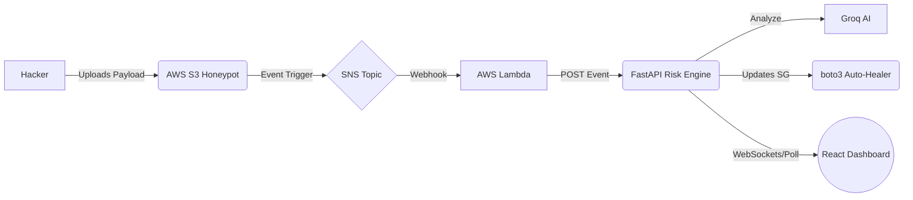

# SentinelMesh 🛡️
**Autonomous AI-Powered Cloud Threat Intelligence Platform**

SentinelMesh is an advanced, self-healing cloud security architecture built specifically to detect, analyze, and autonomously mitigate cyber threats in real-time. By utilizing decentralized AWS honeypots and GroqCloud's blazing-fast LLaMA-3 models, SentinelMesh acts as an intelligent immune system for your cloud infrastructure.

## 🌟 Key Features
- **Global Holographic Threat Map:** Visualizes incoming attacks in real-time on a sci-fi `react-simple-maps` overlay.
- **Serverless Honeypot Pipeline:** Uses AWS S3 event notifications and SNS topics to trap malicious actors with zero compute overhead.
- **Autonomous Auto-Healing:** Boto3 automatically strips compromised IPs from AWS Security Groups without human intervention.
- **AI Audit Generation:** GroqCloud LLaMA-3 dynamically writes executive-level threat summaries and forensic reports.

## 🏗️ Architecture



## 🚀 Quick Start (Local Dashboard)

To boot up the defense dashboard:

1. Clone the repository and navigate to the frontend:
```bash
git clone https://github.com/your-username/SentinelMesh.git
cd SentinelMesh/frontend
```
2. Install the legacy mapping dependencies:
```bash
npm install --legacy-peer-deps
```
3. Boot the Vite Developer Server:
```bash
npm run dev
```

## ☁️ Cloud Backend Setup

The intelligence core relies on Python 3.11+ running either locally or on an EC2 instance.
It requires the following environment variables:

```bash
AWS_ACCESS_KEY_ID="your-aws-access-id"
AWS_SECRET_ACCESS_KEY="your-aws-secret"
GROQ_API_KEY="your-groq-key"
```

To run the backend FastAPI engine:
```bash
cd backend
pip install -r requirements.txt
python3 -m uvicorn main_fastapi:app --host 0.0.0.0 --port 8000
```

*Note: For the full AWS configuration logic (S3 -> SNS -> Lambda), check the `aws_deployment_guide` provided in the codebase.*
